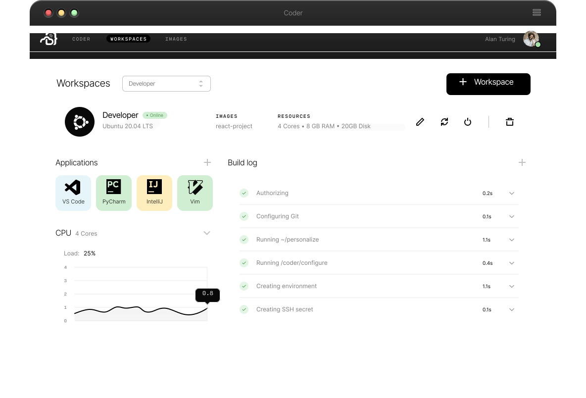

<!-- DO NOT EDIT. THIS IS GENERATED FROM README.md.gotmpl -->

# Coder Helm Chart

[](https://github.com/cdr/enterprise-helm/actions/workflows/build.yml)
[](https://twitter.com/coderhq)

Coder moves developer workspaces to your cloud and centralizes their creation and management. Keep developers in flow with the power of the cloud and a superior developer experience.

The Coder chart is the best way to operate Coder on Kubernetes. It contains all the required components, and can scale to large deployments.



## Getting Started

> ⚠️ **Warning**: This repository will not represent the latest Coder release. Reference
our installation docs for instructions on a tagged release.

View [our docs](https://coder.com/docs/setup/installation) for detailed installation instructions.

## Values

| Key                 | Type | Description | Default                         |
| ------------------- | ---- | ----------- | ------------------------------- |
| cemanager.accessURL | string | The cemanager access URL that the envproxy will use to communicate with the cemanager. This should be a full URL complete with protocol and no trailing slash. Uses internal cluster URL if not set. e.g., https://manager.coder.com | `""` |
| cemanager.image | string | Injected during releases. | `""` |
| cemanager.replicas | int | The number of replicas to run of the manager. | `1` |
| cemanager.resources | object | Kubernetes resource request and limits for cemanager pods. To unset a value, set it to "". To unset all values, you can provide a values.yaml file which sets resources to nil. See values.yaml for an example. | `{"limits":{"cpu":"250m","memory":"512Mi"},"requests":{"cpu":"250m","memory":"512Mi"}}` |
| cemanager.securityContext | object | Contains fields related to the cemanager container's security context (as opposed to the pod). | `{"readOnlyRootFilesystem":true}` |
| certs | object | Describes CAs that should be added to Coder services. These certs are NOT added to environments. | `{"secret":{"key":"","name":""}}` |
| certs.secret.key | string | The key in the secret pointing to the certificate bundle. | `""` |
| certs.secret.name | string | The name of the secret. | `""` |
| clusterDomainSuffix | string | If you've set a custom default domain for your cluster, you may need to remove or change this DNS suffix for service resolution to work correctly. | `".svc.cluster.local"` |
| coderd.replica | object | Configuration for deployment a coder replica to geodistrubute access to workspaces | `{"enable":false,"primaryURL":""}` |
| coderd.replica.enable | bool | Runs a coderd replica instead of the primary application if true | `false` |
| coderd.replica.primaryURL | string | (required for coderd replica) The url of the primary coder deployment | `""` |
| deploymentAnnotations | object |  | `{}` |
| devurls.host | string | Should be a wildcard hostname to allow matching against custom-created dev URLs. Leaving as an empty string results in devurls being disabled. Example: "*.devurls.coder.com". | `""` |
| envbox.image | string | Injected during releases. | `""` |
| environments.nodeSelector | object | nodeSelector is applied to all user environments to specify eligible nodes for environments to run on. See: https://kubernetes.io/docs/concepts/scheduling-eviction/assign-pod-node/#nodeselector  eg. nodeSelector:   disktype: ssd | `{}` |
| environments.serviceAccount.annotations | object | Annotations that should be added to the service account applied to all workspaces. Can be used to bind the service account to a cloud identity | `{}` |
| environments.tolerations | list | Tolerations are applied to all user environments. Each element is a regular pod toleration object. To set service tolerations see serviceTolerations. See values.yaml for an example. | `[]` |
| imagePullPolicy | string | Sets the policy for pulling a container image across all services. | `"Always"` |
| ingress.additionalAnnotations | list | Deprecated. Please use `ingress.annotations`. | `[]` |
| ingress.annotations | object | Additional annotations to be used when creating the ingress. These only apply to the Ingress Kubernetes kind. The annotations can be used to specify certificate issuers or other cloud provider-specific integrations. | `{}` |
| ingress.deployment | object | Options used to configure the Deployment of the default ingress controller. | `{"kind":"Deployment"}` |
| ingress.deployment.kind | string | How to deploy the built-in ingress. Can be "Deployment" or "DaemonSet". | `"Deployment"` |
| ingress.enable | bool | If set to true, a Coder compatible ingress kind will be created. You can configure it with `ingress.annotations` below. | `true` |
| ingress.host | string | The hostname to use for accessing the platform. This can be left blank, and the user can still access the platform from the external IP or a DNS name that resolves to the external IP address. | `""` |
| ingress.loadBalancerIP | string | sets the external IP address of the ingress to the provided value. | `""` |
| ingress.loadBalancerSourceRanges | list | If specified and supported by the platform, the traffic through the cloud-provider load-balancer will be restricted to the specified client IPs. This field will be ignored if the cloud-provider does not support the feature. | `[]` |
| ingress.podSecurityPolicyName | string | The name of the pod security policy the built-in ingress controller should abide. It should be noted that the ingress controller requires the `NET_BIND_SERVICE` capability, privilege escalation, and access to privileged ports to successfully deploy. Ignored if `ingress.useDefault` is false. | `""` |
| ingress.service | object | Options used to configure the LoadBalancer Service used in the default ingress controller. | `{"annotations":{},"externalTrafficPolicy":"Local"}` |
| ingress.service.annotations | object | Additional annotations to add to the Service object. For example, to make the ingress spawn an internal load balancer: annotations:  cloud.google.com/load-balancer-type: "Internal" | `{}` |
| ingress.service.externalTrafficPolicy | string | Denotes whether to route external traffic to node-local or cluster-wide endpoints. "Local" routes external traffic directly to the correct node, while "Cluster" evenly distributes traffic across all nodes, but masks source IPs. | `"Local"` |
| ingress.tls | object | TLS options for the ingress. The hosts used for the tls configuration come from the ingress.host and the devurls.host variables. If those don't exist, then the TLS configuration will be ignored. | `{"devurlsHostSecretName":"","enable":false,"hostSecretName":""}` |
| ingress.tls.devurlsHostSecretName | string | The secret to use for the devurls.host hostname. | `""` |
| ingress.tls.enable | bool | Enables the tls configuration. | `false` |
| ingress.tls.hostSecretName | string | The secret to use for the ingress.host hostname. | `""` |
| ingress.useDefault | bool | If set to true, will deploy an nginx ingress that will allow you to access Coder from an external IP address, but only if your kubernetes cluster is configured to provision external IP addresses. If you would like to bring your own ingress and hook Coder into that instead, set this value to false. | `true` |
| logging.human | string | Where to send logs that are formatted for readability by a human. Set to an empty string to disable. | `"/dev/stderr"` |
| logging.json | string | Where to send logs that are formatted as JSON. Set to an empty string to disable. | `""` |
| logging.splunk | object | Coder can send logs directly to Splunk, in addition to file-based output, if these values are configured. The channel is optional, and this logging is disabled if either the URL and Token are set to the empty string. | `{"channel":"","token":"","url":""}` |
| logging.splunk.token | string | The Splunk HEC collector token. | `""` |
| logging.splunk.url | string | The Splunk HEC collector endpoint. | `""` |
| logging.stackdriver | string | Where to send logs that are formatted for Google Stackdriver. Set to an empty string to disable. | `""` |
| namespaceWhitelist | list | DEPRECATED: A list of additional namespaces to which environments may be deployed. Use multiple workspace providers instead. Existing environments within these namespaces will continue to function, but new environments cannot be created within these namespaces. | `[]` |
| podSecurityPolicyName | string | The name of the pod security policy to apply to all Coder services and user environments. The optional ingress has its own field for pod security policy as well. | `""` |
| postgres.database | string | The name of the database that coder will use. It must exist before Coder is installed. | `""` |
| postgres.host | string | The host of the external postgres instance. | `""` |
| postgres.passwordSecret | string | The name of an existing secret in the current namespace with the password to the Postgres instance. The password must be contained in the secret field `password`. This should be set to an empty string if the database does not require a password to connect. | `""` |
| postgres.port | string | The port of the external postgres instance. | `""` |
| postgres.sslMode | string | Determines how the connection is made to the database. The acceptable values are: `disable`, `allow`, `prefer`, `require`, `verify-ca`, and `verify-full`. | `"require"` |
| postgres.useDefault | bool | Deploys an internal Postgres instance alongside the. platform. We don't recommend running the internal Postgres instance in production. If true, all other values are ignored. | `true` |
| postgres.user | string | the user of the external postgres instance. | `""` |
| serviceAccount.annotations | object | Adds annotations to the service account used for all Coder deployed services. | `{}` |
| serviceAccount.labels | object | Adds labels to the service account used for all Coder deployed services. | `{}` |
| serviceTolerations | list | Tolerations are applied to all Coder managed services. Each element is a toleration object. To set user environment tolerations see environments.tolerations. See values.yaml for an example. | `[]` |
| serviceType | string | See the following for the different serviceType options and their use: https://kubernetes.io/docs/concepts/services-networking/service/#publishing-services-service-types | `"ClusterIP"` |
| services.nodeSelector | object | Node selectors that will be applied to all Coder managed services. See: https://kubernetes.io/docs/concepts/scheduling-eviction/assign-pod-node/#nodeselector | `{"kubernetes.io/arch":"amd64","kubernetes.io/os":"linux"}` |
| ssh.enable | bool | Enables accessing environments via SSH. | `true` |
| storageClassName | string | Sets the storage class for all Coder services and user environments. By default, the storageClassName is unspecified, and thus the default StorageClass is used. If storageClassName is not specified and a default StorageClass does not exist, then the deployment will fail. The storageClass MUST support the ReadWriteOnce access mode. | `""` |
| timescale | object | Contains configuration for the internal database. We don't recommend running this service in production. See the `postgres` section for connecting to an external Postgres database. | `{"image":"","resources":{"limits":{"cpu":"250m","memory":"1Gi"},"requests":{"cpu":"250m","memory":"1Gi","storage":"10Gi"}}}` |
| timescale.image | string | Injected during releases. | `""` |
| timescale.resources | object | Kubernetes resource request and limits for the timescale pod. To unset a value, set it to "". To unset all values, you can provide a values.yaml file which sets resources to nil. See values.yaml for an example. | `{"limits":{"cpu":"250m","memory":"1Gi"},"requests":{"cpu":"250m","memory":"1Gi","storage":"10Gi"}}` |
| timescale.resources.requests.storage | string | Specifies the size of the volume claim for persisting the database. | `"10Gi"` |

## Contributing

Templates for Coder services live in the `templates` directory.
Helm compiles templates with `values.yaml` when deploying.

`README.md` is generated from `README.md.gotmpl` to ensure values are correct. Regenerate the readme:

```shell-session
$ make README.md
```

Deprecation notices should be added to `templates/NOTES.txt`.

## Support

If you experience issues, have feedback, or want to ask a question, open an issue or
pull request in this repository. Feel free to [contact us instead](https://coder.com/contact).

## Copyright and License

Copyright (C) 2020-2021 Coder Technologies Inc.

This program is free software: you can redistribute it and/or modify it under
the terms of the GNU General Public License as published by the Free Software
Foundation, either version 3 of the License, or (at your option) any later
version.

This program is distributed in the hope that it will be useful, but WITHOUT ANY
WARRANTY; without even the implied warranty of MERCHANTABILITY or FITNESS FOR A
PARTICULAR PURPOSE.  See the GNU General Public License for more details.

You should have received a copy of the GNU General Public License along with
this program.  If not, see <https://www.gnu.org/licenses/>.
